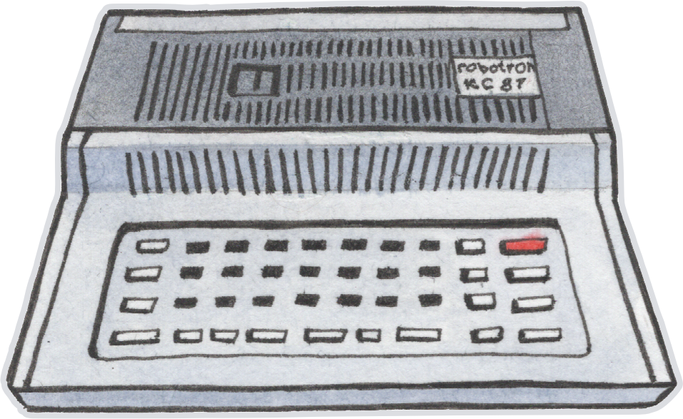
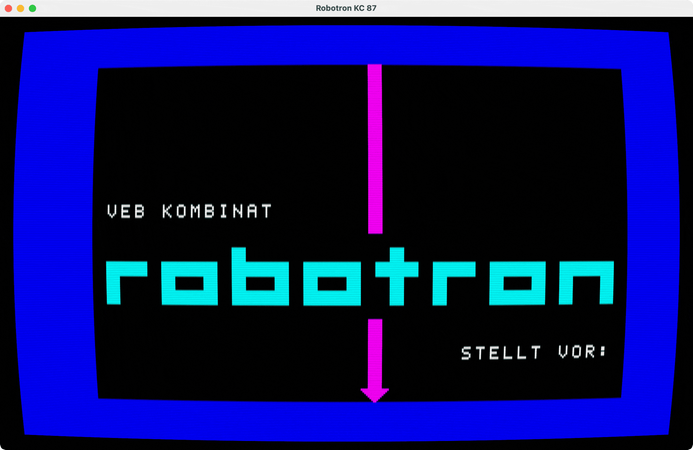
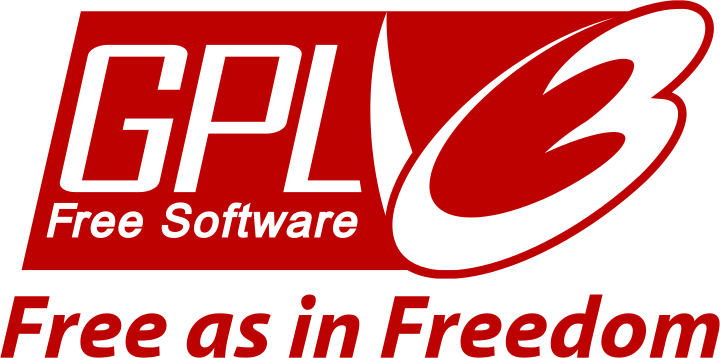

<div align="center"><a href="https://github.com/coignard/kc87">
  <picture>
    <source srcset="https://github.com/coignard/kc87/blob/main/assets/kc87.png?raw=true">
    
  </picture>
</a>

Robotron KC 87 emulator with MIDI support via PIO

[](https://github.com/coignard/kc87/actions)
[](https://github.com/coignard/kc87/security/code-scanning)
[](https://deps.rs/repo/github/coignard/kc87)
[](https://crates.io/crates/kc87)
[](LICENSE)
[](https://ko-fi.com/coignard)

<picture>
  <source srcset="https://github.com/coignard/kc87/blob/main/assets/kc87.gif?raw=true">
  
</picture>

</div>

## Install

To download the source code, build the KC 87 binary, and install it in `$HOME/.cargo/bin` in one go run:

```bash
cargo install --locked --git https://github.com/coignard/kc87
```

You can also install the latest release directly from [crates.io](https://crates.io/crates/kc87):

```bash
cargo install kc87
```

Or install via Homebrew:

```bash
brew install coignard/tap/kc87
```

Alternatively, you can manually download the source code and build the KC 87 binary with:

```bash
git clone https://github.com/coignard/kc87
cd kc87
cargo build --release
sudo cp target/release/kc87 /usr/local/bin/
```

## Install as library

Add the following to your `Cargo.toml`:

```toml
[dependencies]
kc87 = "0.7.0"
```

## Test

```bash
cargo test
```

Tests use a replay-based snapshot system. Each file in `tests/replays/` is a JSON recording of a session: input events, timing, and metadata (ROM name, sample rate, display settings, SHA-256 of the ROM).

The emulator replays the events and at each checkpoint compares machine state and screenshot against the expected dumps in `tests/dumps/`.

To update snapshots after an intentional change:

```bash
UPDATE_SNAPSHOTS=1 cargo test
```

Please note that changes to [u880](https://github.com/coignard/u880) that affect instruction timing or CPU state require manually reviewing and rerecording the affected replays, not just regenerating snapshots.

## Credits

Thanks to Jens Müller for his JKCEMU source code, which was a reference for the RTC, 80-column mode, PZG, Robotron/KRT graphics, and floppy disk controller implementations, Andre Weissflog for inspiring this project with his KC 87 emulator, Volker Pohlers for his Z 9001/KC 87 documentation and test programs, Filippo Scognamiglio for his cool-retro-term shaders, and Olga Podivilova for the KC 87 illustration.

## License



The [KC 87](https://github.com/coignard/kc87) source code is © 2026 René Coignard and licensed under the [GNU General Public License v3.0 or later](LICENSE).

The [KC 87 SDK](https://github.com/coignard/kc87-sdk) source code is © 2026 René Coignard and licensed under the [GNU Lesser General Public License v3.0 or later](https://github.com/coignard/kc87-sdk/blob/main/LICENSE).

The [flat assembler g](https://github.com/coignard/fasmg) source code is © 2015-2025 Tomasz Grysztar and licensed under the [BSD 3-Clause License](https://github.com/coignard/fasmg/blob/master/core/license.txt).

The [cool-retro-term](https://github.com/Swordfish90/cool-retro-term) shaders are © 2013-2021 Filippo Scognamiglio and licensed under the [GNU General Public License v3.0](https://github.com/Swordfish90/cool-retro-term/blob/master/gpl-3.0.txt).
